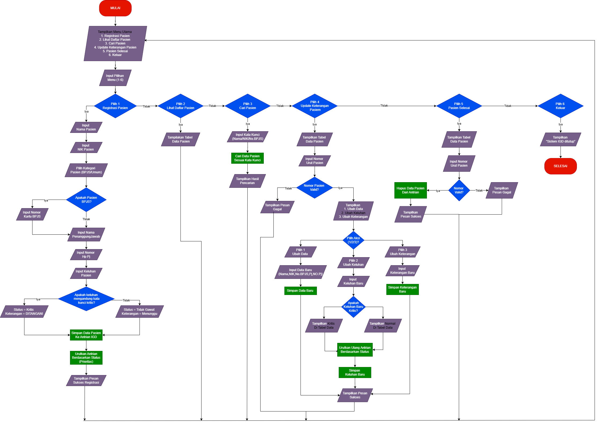

## JUDUL PROJECT : MANAGEMENT IGD RUMAH SAKIT
**KELOMPOK 8 :**

Muhamad Yusuf
Muhamad Rivaldi Aropiq
Muhammad Ikbar Rifa
Elza Olgi Aulia


**STUDI KASUS**

Sistem antrian IGD ini digunakan untuk mengatur urutan pelayanan pasien berdasarkan tingkat kegawatdaruratan (Triage), bukan sekadar waktu kedatangan.

Dalam sistem ini, petugas menginput data pasien berupa nama, NIK, penanggung jawab, serta kategori pasien (BPJS atau Umum). Sistem secara otomatis mendeteksi kata kunci pada keluhan pasien untuk menentukan status prioritas: pasien Kritis akan langsung mendapatkan status "DITANGANI" dan menempati urutan teratas, sedangkan pasien Tidak Gawat akan masuk ke status "Menunggu".

Sistem ini menyimpan data pasien ke dalam daftar antrian digital yang dapat dicari berdasarkan Nama, NIK, atau nomor BPJS secara cepat. Selain menampilkan daftar pasien secara teratur dan terurut, sistem juga memungkinkan petugas untuk memperbarui keterangan penanganan atau menghapus data pasien yang layanannya telah selesai.


## Deskripsi
Pelayanan di Instalasi Gawat Darurat (IGD) menuntut penanganan pasien yang cepat, tepat, dan terorganisir dengan baik. Dalam kondisi darurat, banyaknya pasien yang datang secara bersamaan sering menyebabkan antrian tidak teratur, keterlambatan penanganan, serta risiko kesalahan dalam menentukan prioritas pasien. Jika proses pencatatan dan pengelolaan data pasien masih dilakukan secara manual, petugas IGD dapat mengalami kesulitan dalam memantau kondisi pasien, mencari data pasien tertentu, maupun memperbarui status penanganan pasien.

Selain itu, penentuan tingkat kegawatan pasien sering bergantung pada penilaian awal petugas, yang berpotensi tidak konsisten apabila tidak didukung oleh sistem yang terstruktur. Hal ini dapat menyebabkan pasien dengan kondisi kritis tidak segera mendapatkan penanganan yang seharusnya. Oleh karena itu, dibutuhkan sebuah sistem sederhana yang mampu membantu proses registrasi pasien, penentuan prioritas triage, pengelolaan antrian, serta pembaruan data pasien secara cepat dan teratur. Sistem ini diharapkan dapat meminimalkan kesalahan, meningkatkan efisiensi pelayanan IGD, dan membantu petugas dalam mengambil keputusan awal secara lebih sistematis.

Fitur Utama (Fungsionalitas CRUD):

1. Create (Registrasi Pasien): Mencatat data lengkap: NIK, Nama, Penanggung Jawab, dan Keluhan.
2. Conditional Input: Sistem hanya meminta "No. Kartu BPJS" jika kategori yang dipilih adalah BPJS. Pasien Umum akan otomatis mengisi kolom tersebut dengan tanda hubung (-).

3. Auto-Status: Pasien kritis langsung berstatus "DITANGANI", sedangkan pasien normal berstatus "Menunggu".

4. Read & Sort (Monitoring Real-time):Menampilkan data dalam bentuk tabel yang rapi.Mengurutkan pasien berdasarkan urgensi medis agar tim medis tahu siapa yang harus diproses terlebih dahulu.

5. Search (Pencarian Multi-data):Fitur pencarian cerdas yang memungkinkan petugas menemukan data pasien hanya dengan mengetikkan Nama, NIK, atau Nomor BPJS mereka.

6. Update (Evaluasi Kondisi): Memungkinkan perubahan status (misal: dari "Menunggu" menjadi "Observasi").

7. Re-Triage: Jika keluhan pasien diperbarui, sistem akan menghitung ulang tingkat urgensi dan mengatur ulang posisi antrian jika diperlukan.

8. Delete (Manajemen Selesai): Menghapus data pasien dari daftar aktif jika pasien sudah dinyatakan sembuh, dirujuk ke ruang rawat inap, atau keluar dari rumah sakit.

## Flowchart


## Pseudocode
```ALGORITMA Sistem_IGD_Darurat

DEKLARASI:
    antrian_igd: ARRAY OF DICTIONARY
    pilihan, kat_pilih, aksi: STRING
    nama, nik, no_bpjs, pj, kontak, keluhan, kategori, ket_awal: STRING
    skor, no: INTEGER
    is_kritis: BOOLEAN
    kata_kunci: ARRAY OF STRING = ["stroke", "jantung", "sesak", "pendarahan", "kecelakaan", "tidak sadar", "kejang"]

PROSEDUR info()
    TAMPILKAN Menu (1-6)
END PROSEDUR

PROSEDUR tampilkan_tabel(data_list)
    JIKA data_list KOSONG:
        TAMPILKAN "ANTRIAN KOSONG"
    SELAIN ITU:
        TAMPILKAN Header Tabel
        UNTUK SETIAP p DALAM data_list:
            JIKA p.skor == 1: status = "KRITIS"
            SELAIN ITU: status = "TIDAK GAWAT"
            TAMPILKAN data pasien p
        ENDFOR
    ENDIF
END PROSEDUR

BEGIN (Program Utama)
    LOOP SELAMANYA:
        PANGGIL info()
        INPUT pilihan

        JIKA pilihan == '1': (Registrasi Pasien)
            INPUT nama, nik
            INPUT kat_pilih (1 untuk BPJS, 2 untuk Umum)
            
            JIKA kat_pilih == '1':
                kategori = "BPJS"
                INPUT no_bpjs
            SELAIN ITU:
                kategori = "Umum"
                no_bpjs = "-"
            ENDIF

            INPUT pj, kontak, keluhan
            
            # Logika Auto-Triage
            is_kritis = FALSE
            UNTUK SETIAP k DALAM kata_kunci:
                JIKA k TERDAPAT DALAM keluhan:
                    is_kritis = TRUE
                ENDIF
            ENDFOR

            JIKA is_kritis == TRUE:
                skor = 1
                ket_awal = "DITANGANI"
            SELAIN ITU:
                skor = 2
                ket_awal = "Menunggu"
            ENDIF

            TAMBAHKAN data pasien ke antrian_igd
            URUTKAN antrian_igd BERDASARKAN skor (ASCENDING)
            TAMPILKAN "SUKSES"

        SELAIN JIKA pilihan == '2': (Lihat Daftar)
            PANGGIL tampilkan_tabel(antrian_igd)

        SELAIN JIKA pilihan == '3': (Cari Pasien)
            INPUT cari
            hasil = FILTER antrian_igd DIMANA cari ADA DI nama, nik, ATAU no_bpjs
            PANGGIL tampilkan_tabel(hasil)

        SELAIN JIKA pilihan == '4': (Update Pasien)
            PANGGIL tampilkan_tabel(antrian_igd)
            JIKA antrian_igd TIDAK KOSONG:
                INPUT no
                INPUT aksi (1 untuk Ket, 2 untuk Keluhan)
                
                JIKA aksi == '1':
                    INPUT keterangan_baru
                    UPDATE antrian_igd[no].keterangan
                SELAIN JIKA aksi == '2':
                    INPUT keluhan_baru
                    UPDATE antrian_igd[no].keluhan
                    # Re-Triage
                    HITUNG ULANG skor berdasarkan kata_kunci
                    URUTKAN antrian_igd BERDASARKAN skor
                ENDIF
            ENDIF

        SELAIN JIKA pilihan == '5': (Selesai/Hapus)
            PANGGIL tampilkan_tabel(antrian_igd)
            JIKA antrian_igd TIDAK KOSONG:
                INPUT no
                HAPUS antrian_igd[no]
                TAMPILKAN "SUKSES"
            ENDIF

        SELAIN JIKA pilihan == '6': (Keluar)
            KELUAR LOOP
            
        SELAIN ITU:
            TAMPILKAN "Pilihan tidak valid"
        ENDIF
    ENDLOOP
END